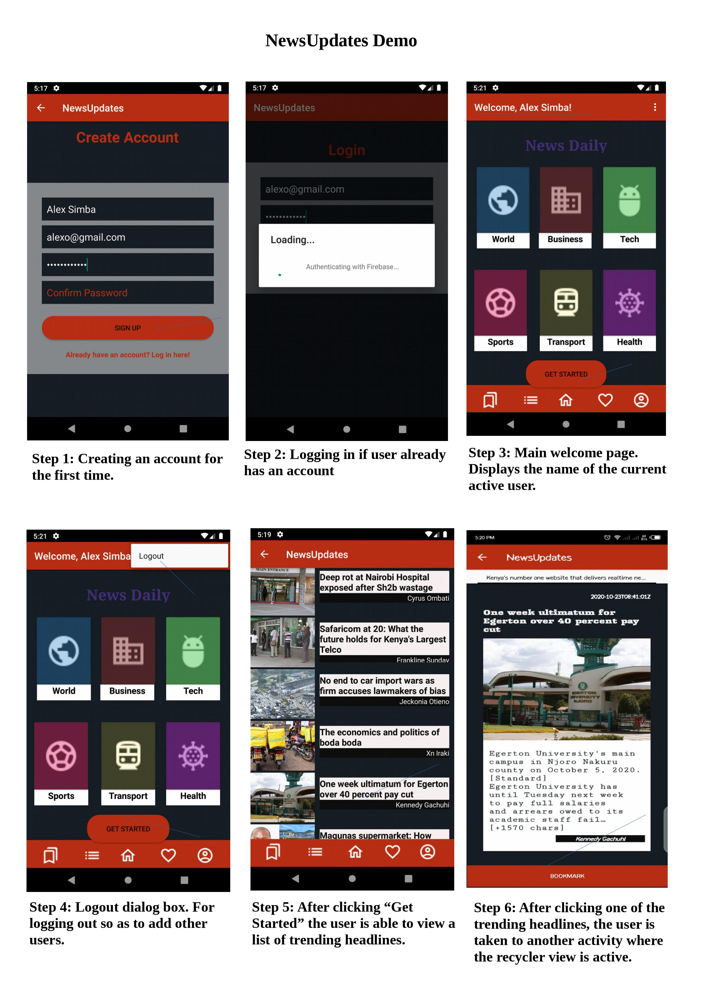

# NewsUpdate App

### Shem Brooklyne

## Description 
NewsUpdated App is an android news updater app that scopes the latest news all over via a news Api that will be used to generate news all over.

## -- Background Information --
API News Is JSON API for live news and blog articles from the media. This project uses retrofit2 as HTTP Clent - Retrofit is a REST Client for Java and Android. Its use is very easy.

 - - News API

• Retrofit.

• Picasso square for the Image Network.

• Material design.

## Setup/Installation and Usage
- Clone this repository and open with Android Studio
- https://github.com/ShemBrooklyne/NewsUpdate
- Emulate on a virtual Machine or on your Phone Device
- Get your API key https://newsapi.org/register
- |Replace your API key
- `public static final String API_KEY = "your secret api key";`

## Quick Demo of the App
What you get after starting the app     
 

## Future Implementation.
- Search for news Via Query parameters. i.e
1. Country   `us`  `uk`  `Ab`  `Ke`  `ug` `Tz` 
2. Category   `Business` - `News` - `Technology` - `Health` - `Sports` - `Transport`
## TECHNNOLOGIES USED
- Java
- Android Studio
- Xml
- Roboelectric
- Espresso
- Postman - For testing the responses from the endpint params.

## Api Used
- News-Api - https://newsapi.org/

## Brief Scope of the Api
* End point used: 
-Top headlines /v2/top-headlines
- - Whereby this endpoint returns eturns breaking news headlines for a country and category, or currently running on a single or multiple sources. This is perfect for use with news tickers or anywhere you want to display live up-to-date news headlines and images as the response. 

### LICENSE

* LICENSED UNDER  

